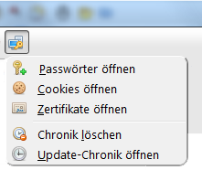
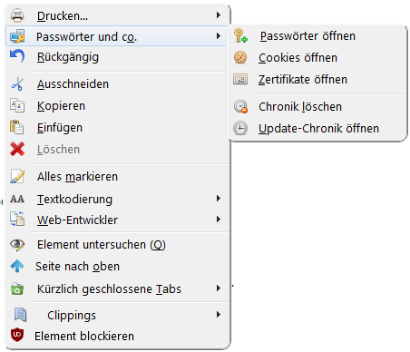

**passwordplus.uc.js**

Dieses Script fügt der Navigationsleiste eine neue Schaltfläche hinzu.  
Sie kann über den Anpassendialog frei verschoben werden.  
  
Diese Schaltfläche verfügt über ein Kontextmenü mit folgenden Einträgen:
* Passwörter öffnen
* Cookies öffnen
* Zertifikate öffnen
* Chronik löschen
* Update-Chronik anzeigen

das selbe Menü wird auch dem Hauptkontextmenü hinzugefügt.

Sieht dann so aus:

### Button + Menü:
 

### Kontextmenü:
  

Wer die Symbole bei den Menüs haben möchte muss über die userChrome.css
die Css Datei pawuco.css laden.

## Installation

Kopiere die uc.js-Datei in den Chromeordner des Profils und ziehe den Button an die gewünschte Stelle.
